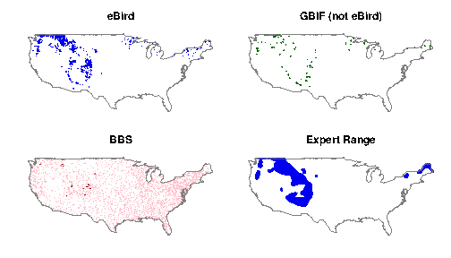
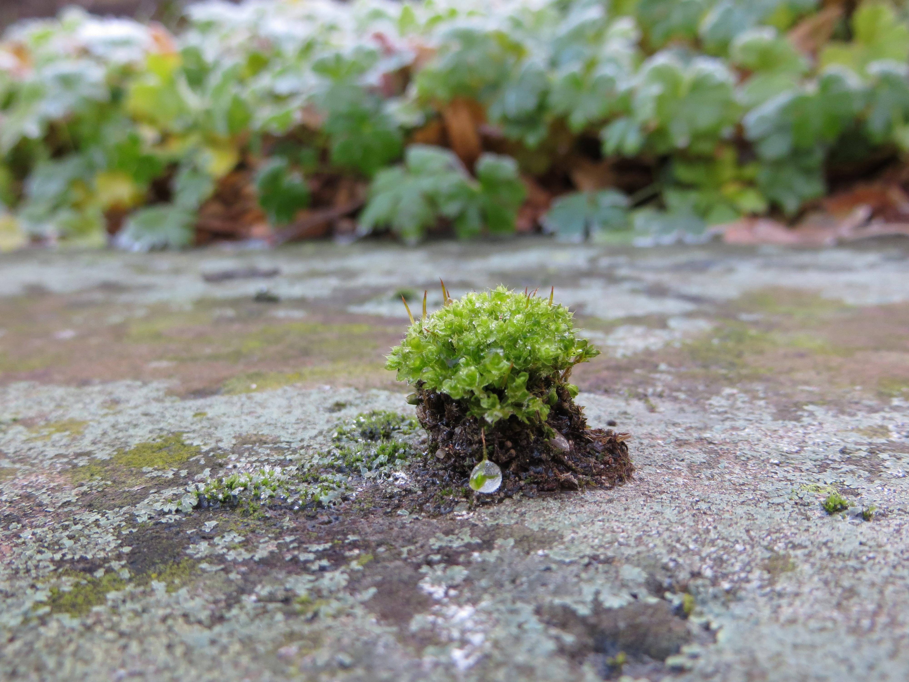

Introduction to Species Distribution Models
========================================================
author: Bob O'Hara
date: Sept 11 2015

Where is this species?
========================================================

Why is it there?
========================================================

What we want
========================================================

A prediction of its distribution

Estimation of the factors affecting the distribution

But why is the species there?
========================================================

The environment!

So, we need to make the link
========================================================

Observations -> Environment -> Distribution

To put it another way
========================================================

We observe data in geographic space, 

want to model this in environmental space, 

and then predict back into geographic space

Two sides of the same coin
========================================================

Species Distributions - in geographic space

Niche - in environmental space

The BAM model
========================================================

The distribution of the species is determined by:

 - Biotic 
 - Abiotic
 - Movements

Most SDMs only deal with the Abiotic

Fundamental and Realised Niches
========================================================

Fundamental = Abiotic

Realised = Biotic (and perhaps Movement)

What's the role of space?
========================================================

Most SDMs ignore it in the model: it just (!) provides a convenient way of representing the distribution

The Mathematical Model
========================================================

Is a species there or not?

Model as probability, as not certain

So, 

$$Pr(I=1) = f(env)$$

Complexities
========================================================

We don't have perfect data, thus we need $Pr(X=1|I)$

This will depend on the type of data

Different data means different models

The Environmental Niche
========================================================

Can model $f(env)$ in many ways

- Linear
- Spline
- Neural Nets
- Eccentric Landing Platforms for Pixies
- etc etc

What we Usually Model
========================================================

How the observed distribution is predicted by the environment.

Environment -> Fundamental Niche

BUT

We observe the realised niche

And Now
========================================================

...  we can have a simple tutorial

