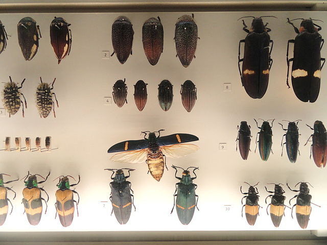
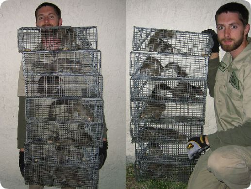
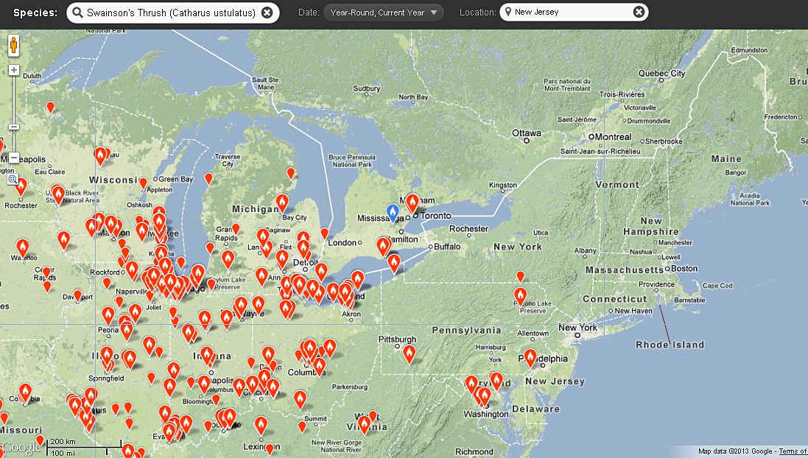

Presence/Absence and Presence Only
========================================================
author: Bob O'Hara
date: Sept 11 2015

Different ways of collecting data
========================================================

"Buprestidae - Naturmuseum Senckenberg - DSC02118" by Daderot - Daderot. Licensed under CC0 via Wikimedia Commons - https://commons.wikimedia.org/wiki/File:Buprestidae_-_Naturmuseum_Senckenberg_-_DSC02118.JPG#/media/File:Buprestidae_-_Naturmuseum_Senckenberg_-_DSC02118.JPG

Surveys
========================================================

Go to a site, look for the species. If you see it, it's present. If not, it may be absent

For the moment, assume you are brilliant & if you don't see it, it's definitely not there

Collections 
========================================================

Museums have specimens with their locations recorded

So, we only have presences but no records of absences

Different Models
========================================================

Presence/Absence and Presence Only

(If we have several visits to a site, then we can use occupancy models)

Presence Absence
========================================================

For each site we observe presence ($Y$=1) or absence ($Y$=0).

We can model $Pr(Y=1)$. e.g. a logistic regression:

$$log{\frac{p}{1-p}} = X \beta$$

Presence Only
========================================================

Need to somehow model where the species might not be

Two and a half methods:

- Presence/pseudo absence
- MaxEnt
- Point Process

Assume sampling is uniform across space

Presence/pseudo absence
========================================================

We have presences

Select some pseudo-absences at random

Treat the problem as a presence-absence analysis

"Contaminated controls"

MaxEnt
========================================================

Again, select a lot of pseudo-absences at random

Rather than logistic regression, maximise the entropy:

$$E = \sum p \log p + C$$

Where C is some constraints

Point Processes 
========================================================

Assume that there is some density ($e^{\eta(s)}$) across space, and the higher density the more like there is to be a presence

Then in any area $A$, number of obervations follows a Poisson Process with mean $\lambda$:

$$\lambda = \int_A e^{\eta(s)}ds$$

The likelihood for the data (X) has to integrate over the whole area, This is calculated numerically by chosing some integration points at which to calculate the density.

Why one and a half?
========================================================

It turns out that MaxEnt and the point process approach are the same, except for the intercept

Pseudo-absence approach is an approximation to the same process

Calibration
========================================================

If we do not know $Pr(X=1|I)$ but it is constant then

$$Pr(X=1) = Pr(X=1|I)Pr(I=1) = pf(env)$$

So we can still estimate differences in occupancy, but can't calibrate 

If $f(env)$ is higher, more likely spoecies is present

Thresholds
========================================================

Sometimes we want to say which sites are occupied. Do this by stetting a threshold for $f(env)$: if it is above this, say species is present, else absent.

Can set threshold to minimise cost of error. Have to decide which is more costly: false positives or false negatives

Confusion matrix
